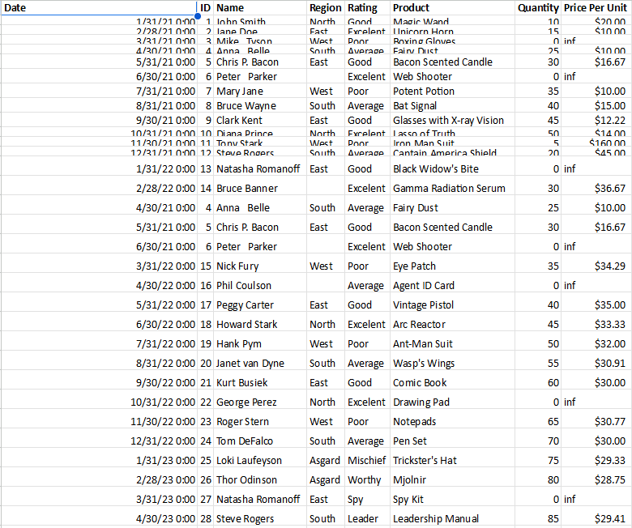
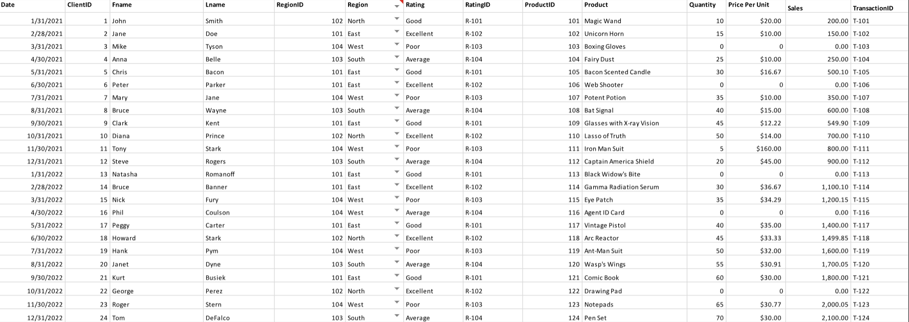

# Midterm Lab Task 1 - Data Cleaning and Preparation using Excel
In this activity, we cleaned an excel sheet full of errors and redundancy using different excel features.

## Step 1 - Data Cleaning
- Download the raw file and open it.
- Adjust the column width and row height formatting.
- Remove duplicates and null values.
- Follow the given data validations
- Save the file.

## Step 2 - Data Normalization
- Open the cleaned excel file.
- Assign necessary ID required.
- Seperate data into appropriate sheets.
  
## Before

## After

## Step 3 - Relational Data Model
- Identify the assigned unique IDs.
- Use the excel data manager and create the relationship using primary and foreign keys.
- Save and validate the structure.

## Relational Data Model

